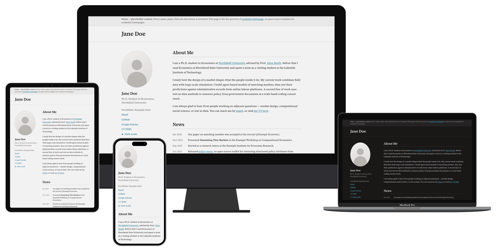
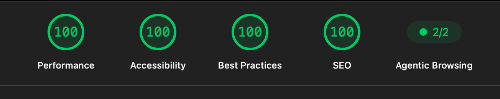

<div align="center">

# academic-homepage

[](https://github.com/siruizou2005/academic-homepage/stargazers)
[](https://github.com/siruizou2005/academic-homepage/network/members)
[](https://github.com/siruizou2005/academic-homepage/issues)
[](LICENSE)
&nbsp;|&nbsp;
[English](README.md)

### 快、干净的单页学术主页 —— 用 Astro 构建

改一个文件，推到 GitHub Pages 就能上线。



[**在线演示**](https://siruizou.com/academic-homepage/) &nbsp;·&nbsp;
[**用这个模板建仓库**](https://github.com/siruizou2005/academic-homepage/generate)

<br>

<a href="https://pagespeed.web.dev/analysis?url=https%3A%2F%2Fsiruizou.com%2Facademic-homepage%2F&form_factor=mobile"></a>

<sub>移动端，跑的是上面那个线上演示页——这是当前分数，不是目标。<br>
别信我，自己验证：<a href="https://pagespeed.web.dev/analysis?url=https%3A%2F%2Fsiruizou.com%2Facademic-homepage%2F&form_factor=mobile">用 PageSpeed Insights 跑一次</a>（点开就是新测），或者本地跑 <code>npx lighthouse https://siruizou.com/academic-homepage/</code>。</sub>

</div>

## 适合谁

这个模板是给学术生涯早期的人做的——本科生、硕博在读、博士后，或者刚工作
一两年的研究者。在这个阶段，你的全部履历放得进一页：几篇论文、几个项目、
一些教学经历。整个设计就是围绕这一点来的：访客不用点任何东西，一分钟能把
你看完。

履历长了就不合适了。当你有三十篇论文、多年的报告和相应的教学记录时，
单页滚动就不再帮你了——论文列表会把其余内容全部淹没，访客也没有办法直接
跳到他要找的部分。那时候你需要的是每个板块一个页面的模板，
[al-folio](https://github.com/alshedivat/al-folio) 或
[academicpages](https://github.com/academicpages/academicpages.github.io)
会更适合你。内容再多这个模板也不会坏，只是它帮不上忙了。

## 特点

大多数学术主页模板要求你先学会它的一套布局系统，才能把自己的名字放上去。
这个模板只要求你改一个列表。

```js
// src/data.js
export const publications = [
  {
    title: "Simulating Thin Markets: Agent-Based Evidence on Matching",
    authors: "<strong>Jane Doe</strong> and John Roe",
    venue: "<em>Journal of Example Economics</em>, 14(2), 331–368",
    abstract: "Thin markets — those with few buyers, few sellers, or both …",
    bibtex: `@article{doe2025simulating, … }`,
    links: [{ label: "Paper", href: "…" }, { label: "Code", href: "…" }],
  },
];
```

这段数据会渲染成一条论文条目：可展开的 Abstract 面板、带复制按钮的 BibTeX
面板、以及一排方框链接。把数组清空，Publications 整个板块就消失。页面上每个
板块都是这样工作的。

- **只改一个文件**：姓名、链接、About、News、教育经历、论文、科研经历、项目、
  获奖、教学，全部在 `src/data.js` 里。
- **板块自动隐藏**：数组为空就不渲染，不会留下半成品的「敬请期待」。
- **浅色 / 深色**：默认跟随系统，侧栏有手动开关。
- **天生就快**：浏览器端没有任何框架运行时——一份 HTML、约 2 KB 内联 JS、
  一份 CSS。首次加载约 65 KB，其中大部分是字体。
- **字体自托管**：构建时下载并做子集化，运行时不请求 Google，字体加载也不会
  造成布局跳动。
- **能被搜到**：canonical、Open Graph / Twitter 卡片、给不支持 WebP 的抓取器
  单独生成的 JPEG 分享图、由你自己的内容自动拼出的 `schema.org/Person`
  结构化数据，以及自动生成的 `robots.txt` 和 `sitemap.xml`。
- **不执行 JS 的爬虫也能读到摘要**：Abstract 一开始就在 HTML 里，脚本只负责
  折叠它。
- **LaTeX 简历放在同一个仓库**，简历和链接到它的主页不会各改各的。
- **可访问性**：真实的焦点框、达到 WCAG AA 的文字对比度、按钮就是按钮。

## 快速开始

需要 [Node.js](https://nodejs.org) 20 或更高版本。

```bash
# 1. 拷一份（或者点上面的 "Use this template"）
npx degit siruizou2005/academic-homepage my-homepage
cd my-homepage

# 2. 安装并启动
npm install
npm run dev          # http://localhost:4321

# 3. 改成你自己的
#    src/data.js          — 页面上看得见的所有内容
#    src/site.config.js   — 网址、SEO、主题默认值
#    src/assets/photo.jpg — 你的照片（大约 5:6）
```

然后把 `src/site.config.js` 顶部的 `demoNotice` 改成 `false`，去掉演示页顶部
那条「这是占位内容」的提示。

| 命令 | 作用 |
| --- | --- |
| `npm run dev` | 开发服务器，热更新 |
| `npm run build` | 构建静态站点到 `dist/` |
| `npm run preview` | 本地预览构建结果 |
| `npm run lint` | 检查 JavaScript |
| `npm run subset:cn` | 为中文姓名重新生成字体子集 |

## 改成你自己的

### 内容

`src/data.js` 就是整个页面。每个板块是一个数组，清空即隐藏。想调整板块顺序，
在 `src/pages/index.astro` 里移动对应的块。

`about`、`news`、`authors`、`venue` 这几个字段是 HTML 片段，所以可以在里面写
链接或斜体：

```js
venue: "<em>Journal of Example Economics</em>, 14(2), 331–368",
```

其余字段都是纯文本。

**照片**放在 `src/assets/photo.jpg`。页面上是竖椭圆裁切，所以大约 5:6、
脸在垂直方向居中的构图最合适。**校徽**放在 `src/assets/logos/`，正方形、
透明背景。

图片放在 `src/assets/` 而不是 `public/`，是为了让 Astro 在构建时压缩、转 WebP
并生成 `srcset`：一张 120 KB 的原图最终只有 14 KB 左右。同名替换即可，
其余交给构建。

**简历**：把 PDF 放进 `public/`，文件名带上年月（别人存下来一眼知道是哪一版），
然后改 `src/data.js` 顶部的 `CV_URL`。

### 站点配置

`src/site.config.js` 管的是页面文字以外的东西：部署地址、语言、SEO 描述、
结构化数据、爬虫规则、主题默认值。

```js
theme: {
  default: "system",  // "system" | "light" | "dark"
  toggle: true,       // 侧栏是否显示切换开关
},
robots: {
  indexing: true,
  aiCrawlers: true,   // 改成 false 会请求 GPTBot、ClaudeBot 等不要抓取
},
```

如果设成 `default: "light"` 且 `toggle: false`，页面不会带任何主题相关的
JavaScript。

### 配色与字体

所有颜色都是 `src/styles/index.css` 顶部的 token，写成
`light-dark(浅色值, 深色值)`，改一对值两个主题一起变：

```css
--color-accent: light-dark(#0088b0, #8fdcf5);
```

字体在 `astro.config.mjs` 里设置——把 `name` 换成 Google Fonts 上任意一款，
Astro 会在构建时下载、子集化并自托管。`cssVariable` 不要改，样式表读的是它。

### 中文姓名

在 `src/data.js` 里填上 `profile.nameCn`，页头就会在英文名旁边显示中文名，
字号经过调整，两者视觉高度一致。

Astro 的字体管线按「字符集」做子集，中文最细也只能到整个简体字集——为两三个字
下载好几 MB。所以中文名单独走一条路：

```bash
npm run subset:cn                      # 读取 src/data.js 里的 nameCn
npm run subset:cn -- 张三               # 或者直接传字符
npm run subset:cn -- 張三 --family "Noto Serif TC"
```

它会重新生成 `public/fonts/cjk-name-subset.woff2`，通常 1–2 KB。
`nameCn` 留空时，字体文件和 `@font-face` 都不会输出。

### 目录结构

```
src/
  data.js            页面全部内容
  site.config.js     网址、SEO、主题、爬虫规则
  layouts/Base.astro <head>：SEO、分享卡片、字体、主题初始化
  pages/
    index.astro      板块顺序
    404.astro
    robots.txt.js    由 site.config.js 生成
    sitemap.xml.js   自动列出实际存在的页面
  components/
    Sidebar.astro    照片、姓名、链接、主题开关
    Section.astro    标题与分隔线
    EntryList.astro  教育 / 科研 / 项目 / 获奖 / 教学 通用条目
    NewsList.astro   带日期的动态
    PubItem.astro    论文条目，含 Abstract 与 BibTeX 面板
    ThemeToggle.astro
  styles/index.css   设计 token 与布局
  assets/            照片与校徽（构建时处理）
public/              简历、favicon、中文字体子集（原样复制）
cv/cv.tex            简历的 LaTeX 源码
scripts/             中文字体子集脚本
```

有两个取舍值得说明。**摘要写在 HTML 里**，是因为 Google、Semantic Scholar
以及越来越多的 LLM 爬虫只读服务器返回的内容，点击后才渲染的面板对它们不存在；
所以两个面板一开始就带 `hidden` 输出，脚本只负责切换。**分享图是 JPEG**，
因为页面上的头像是 WebP，而微信和 LinkedIn 对 WebP 的链接预览支持并不稳定。

## 部署

### GitHub Pages

1. 推到 GitHub 仓库。
2. **Settings → Pages → Source 选 GitHub Actions**。这是唯一需要手动做的一步，
   因为创建 Pages 站点需要的权限，无法授予工作流内置的那个 token。
3. 推到 `main` 分支，`.github/workflows/deploy.yml` 会自动构建并发布。

工作流会读取你的 Pages 设置并把真实地址传进构建，所以下面三种情况都不用改配置，
canonical、分享卡片和 sitemap 都是对的：

| 站点位置 | 你要做的 |
| --- | --- |
| `你的用户名.github.io` | 仓库名就叫 `你的用户名.github.io`，其余不用管 |
| `你的用户名.github.io/仓库名/` | 什么都不用做，子路径会被自动识别 |
| 自定义域名 | 在 Settings → Pages 里设好，并新建 `public/CNAME`，里面只写一行域名 |

`public/CNAME` 是自定义域名在每次部署后仍然生效的原因——用自定义域名的话，
千万别删这个文件。

有一点值得提前知道：如果你的 `你的用户名.github.io` 仓库绑了自定义域名，
GitHub 会把这个账号下**所有** project pages 都改从那个域名走，本模板就会落在
`你的域名.com/仓库名/`，而 `github.io` 的地址会 301 跳过去。上面那个演示页
之所以在 `siruizou.com` 的路径下，就是这个原因。

本地构建和其他托管平台，请在 `src/site.config.js` 里设置 `url` 和 `base`。

### 其他平台

`npm run build` 产出纯静态的 `dist/`。Netlify、Vercel、Cloudflare Pages、
自建 nginx 都可以直接托管，没有服务端。

## 用了这个模板的主页

用了的话，欢迎提一个 PR 把你的主页加到这里——一个真实链接比任何文档都有说服力。

- [演示页](https://siruizou.com/academic-homepage/)——占位内容，
  始终与 `main` 同步

## 致谢

基于 [Astro](https://astro.build) 构建。正文字体
[Source Serif 4](https://fonts.google.com/specimen/Source+Serif+4)，
中文名用 [Noto Serif SC](https://fonts.google.com/noto/specimen/Noto+Serif+SC)，
均为 SIL 开放字体许可证。README 顶部的设备外框来自
[devices.css](https://github.com/picturepan2/devices.css)（MIT）。

仓库里的所有内容都是虚构人物的占位数据——没有任何真实姓名、论文或链接。

## 许可证

[MIT](LICENSE)。随便用、随便改、随便发布；署名欢迎但不强制。
